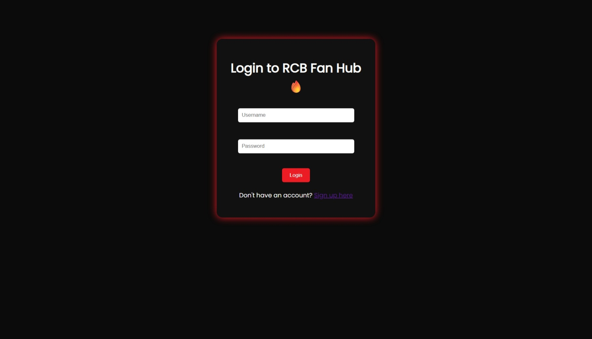
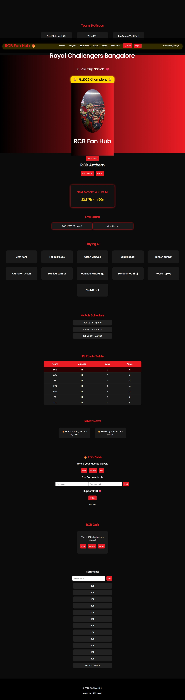

# ShadowFox-IPL-Website
RCB Fan Hub – A dynamic IPL team website with login/signup system, player names, Team Anthem , match schedules, Live scoring, next match countdown ,stats, quiz ,points table ,engagement features and commenting feature built using HTML, CSS, and JavaScript.
#  RCB Fan Hub Website
*Designed with focus on user interaction and fan engagement.*

RCB Fan Hub is a dynamic and interactive web application dedicated to Royal Challengers Bangalore (RCB) fans. It serves as a one-stop platform for accessing team-related information, player details, match schedules, statistics, and fan engagement features.

##  Features

-  Login & Signup System using Local Storage
-  Player Profiles with roles and performance stats
-  Match Schedule section
-  Team Statistics dashboard
-  Latest News updates
-  Fan Comments section
-  Fan Poll system
-  Quiz section for engagement
-  Like button for fan support
-  RCB Chant audio feature

## Technologies Used

- HTML
- CSS
- JavaScript

##  Live Demo
(After deployment ,add your link here)
https://nithyasrimorla-png.github.io/ShadowFox-IPL-Website/login.html

# Project structure
rcb-fan-hub/
│
├── index.html
├── login.html
├── signup.html
├── style.css
├── script.js
│
├── assets/
│   ├── kohli.jpg
│   ├── rcb.mp3
│
├── README.md

##  Website Preview

